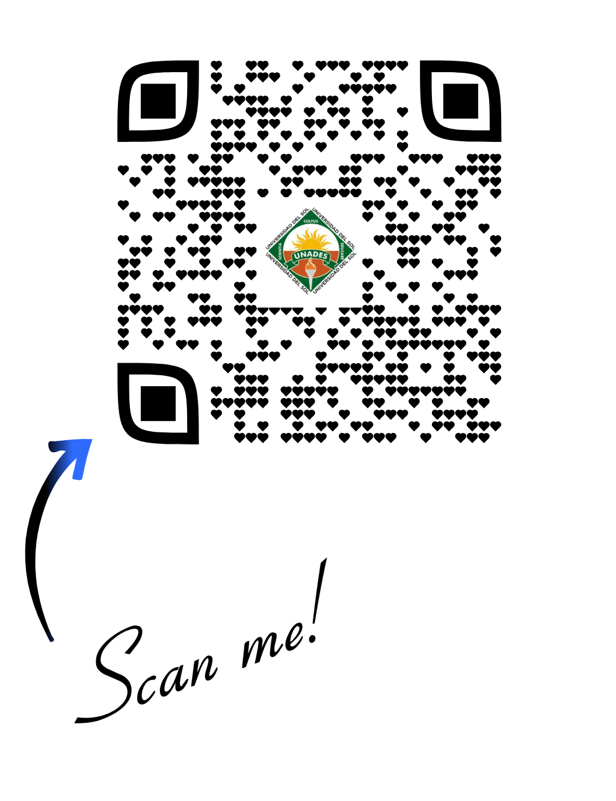

::: {style="text-align: center;"}
## Bienvenidos

### Formulación y Evaluación de Proyectos de Inversión

Cuarto año – Administración de Empresas

Profesor: Mg. Andreas Schneider, CERM
:::
------------------------------------------------------------------------

## {width="700" height="670"}

---

## Sobre el profesor

-   Formación académica

-   Experiencia profesional

-   Áreas de investigación

-   Interés en análisis de datos y proyectos

-   [Mas informacion](https://schneiderpy.netlify.app/)

------------------------------------------------------------------------

## Pregunta inicial

Antes de empezar:

**¿Qué entienden por "proyecto de inversión"?**

------------------------------------------------------------------------

## Objetivo del curso {.smaller}

Al finalizar el curso los estudiantes podrán:

1.  Configurar y utilizar un entorno de proyecto reproducible (R, RStudio, Git, GitHub, Quarto).
2.  Aplicar la plantilla SCReport para elaborar un estudio de viabilidad con formato profesional.
3.  Realizar análisis de mercado, técnicos, financieros y de riesgos para un proyecto de inversión real.
4.  Calcular e interpretar indicadores financieros clave: VPN, TIR y periodo de recuperación.
5.  Colaborar de forma asíncrona mediante ramas de Git, commits y pull requests.
6.  Presentar y defender sus hallazgos en equipo.
7.  Crear su propio portafolio de proyectos como evidencia.

------------------------------------------------------------------------

## Estructura general del curso

Capítulos principales:

1.  Introducción a los proyectos
2.  Estudio de mercado
3.  Ingeniería del proyecto
4.  Relaciones de mercado
5.  Aspectos financieros
6.  Evaluación del proyecto
7.  Aspectos organizacionales
8.  Estudio de caso

------------------------------------------------------------------------

## Cómo trabajaremos durante el semestre

El curso está basado en **un proyecto práctico**.

Cada grupo desarrollará durante el semestre:

**Un proyecto de inversión completo**

------------------------------------------------------------------------

## Metodología del curso

Cada semana:

1.  Parte conceptual (teoría)
2.  Aplicación al proyecto (con un ejemplo?)
3.  Avance del estudio de caso (Laboratorio)

------------------------------------------------------------------------

## Resultado final del curso

Cada grupo entregará:

-   Documento del proyecto
-   Análisis financiero
-   Evaluación del proyecto
-   Presentación final (verbal)

------------------------------------------------------------------------

## Herramientas que utilizaremos

Durante el curso usaremos:

-   **Quarto**
-   **GitHub**
-   **RStudio**
-   **R (eventualmente)**

------------------------------------------------------------------------

## ¿Por qué estas herramientas?

Permiten:

-   organizar el trabajo
-   documentar proyectos
-   mantener control de versiones
-   generar informes profesionales

------------------------------------------------------------------------

## Flujo de trabajo

Proyecto → Documento → Repositorio

``` text
Quarto → documento
R → análisis
GitHub → control de versiones
```

------------------------------------------------------------------------

## Herramientas y instalacion {.smaller .scrollable}

::: callout-caution
Computadoras antiguas y Windows 32-bit tienen un tratamiento distinto. El siguiente procedimiento aplica para sistemas de Windows 64-bit!
:::

::: fragment
Instalar git

- [Documentacion - esp](https://git-scm.com/book/es/v2/Inicio---Sobre-el-Control-de-Versiones-Instalaci%c3%b3n-de-Git)

:::


::: fragment
R y RStudio

-   [R y RStudio](https://posit.co/download/rstudio-desktop/)
:::

::: fragment
Instalación de *tinytex*

-   install.package(tinytex)

-   quarto install tinytex
:::

---

## Continuacion ...


::: fragment
Crea una cuenta de GitHub

Crea repo para el proyecto, por ejemplo, github.com/tunombre/proyecto-inversión

-   [Documentacion en espanhol](https://docs.github.com/es/get-started/start-your-journey/creating-an-account-on-github)
:::

::: fragment
Instalar template (plantilla)

-   quarto::quarto_use_template("schneiderpy/screport")
-   quarto use template schneiderpy/screport
:::

------------------------------------------------------------------------

## Propuesta inicial

{fig-align="center"}
