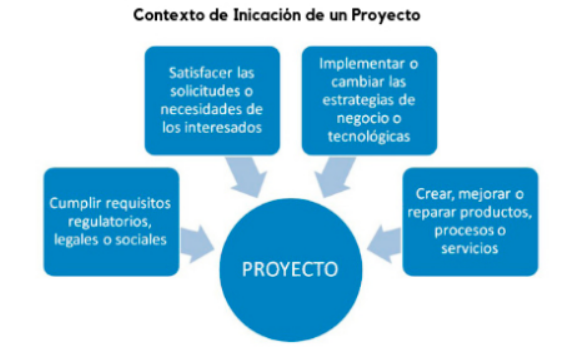
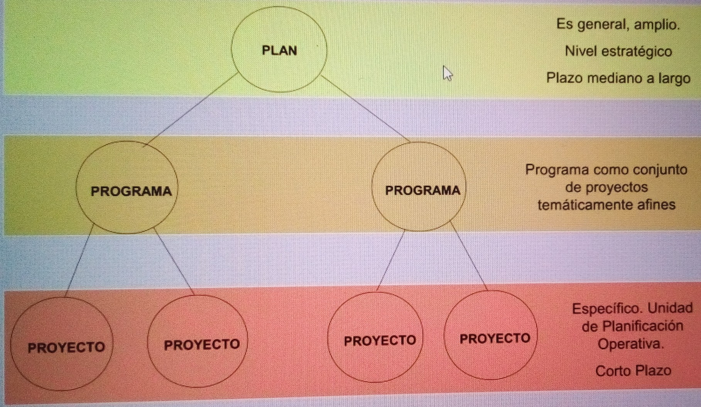
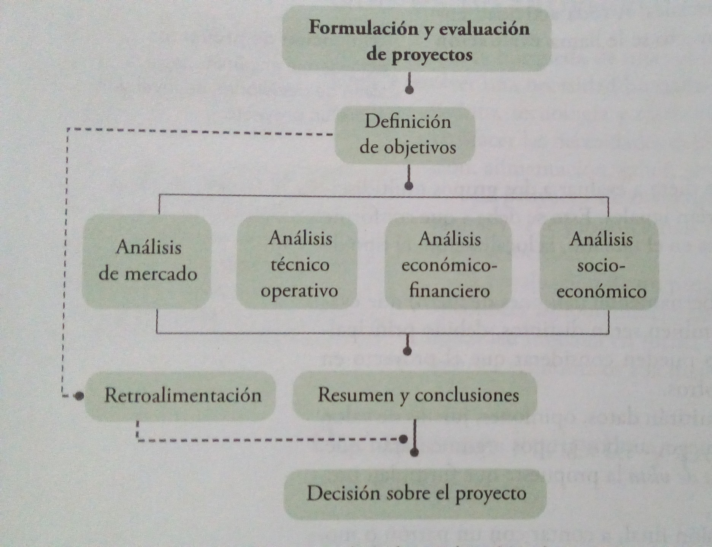
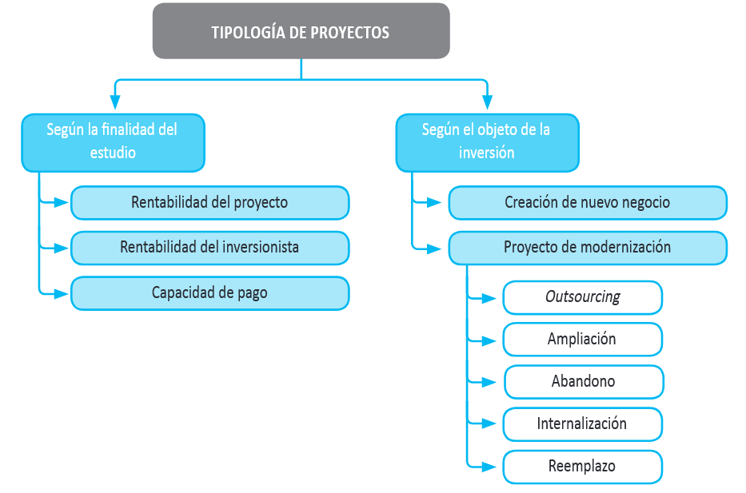
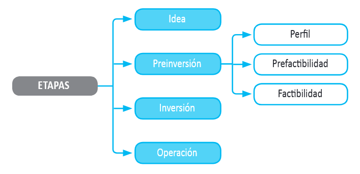
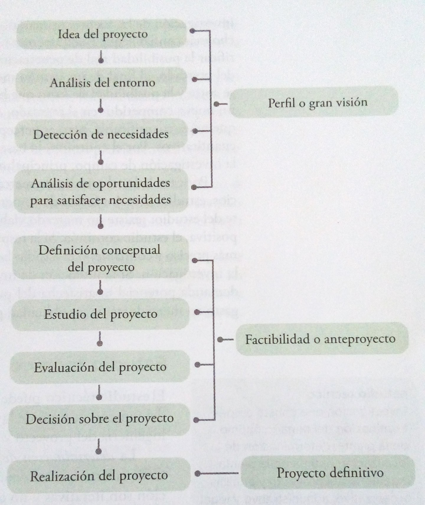

::: {style="text-align: center;"}
**Unidad: 1** 

**Introducción - Formulación y Evaluación de Proyectos de Inversión**

7to. Semestre – Administración de Empresas / Ing. Comercial

Profesor: Mgtr. Andreas Schneider, CERM

:::
------------------------------------------------------------------------

### Objectivo general {.unnumbered}

Al concluir el estudio de este capitulo el alumno sabrá que es un proyecto
e identificara sus partes y objetivos.

---

### Objetivos especificos {.unnumbered .smaller}

- *Definir*    que es un proyecto.
- *Exponer*    las causas que hacen importantes a los proyectos.
- *Mencionar*  las partes generales de que consta la evaluación de un proyecto.
- *Explicar*   cual es el objetivo del estudio de mercado.
- *Comprender* en que consiste el estudio técnico.
- *Explicar*   que se pretende con el estudio económico.
- *Determinar* cual es el objetivo de la evaluación económica.

# Conceptulizacion

## Que es un proyecto? {.smaller}

- Un proyecto es la búsqueda de una solución inteligente al planteamiento
de un problema, **la cual tiende a resolver una necesidad humana**,
por ejemplo, de educación, alimentación, salud, ambiente, cultura, etc.

- Un proyecto de inversión es un plan que, si se le asigna determinado
monto de capital y se le proporcionan insumos de varios tipos, producirá
un bien o un servicio, útil a la sociedad.

- La **evaluación** de un proyecto de inversión, cualquiera que este sea,
tiene por objecto **conocer su rentabilidad económica y social**, de tal
manera que asegure resolver una necesidad human en forma eficiente, segura
y rentable.

---

## {.unnumbered .smaller}
Un proyecto es:

- la unidad nuclear de la planificación operativa
- debe ser consistente con la planificación estratégica
- organiza recursos (concentrados) y actividades
- tiene un plazo acotado
- tiene un costo determinado (presupuesto)
- se realiza bajo una unidad de gerencia
- involucra a una población definida
- se desarrolla en un ámbito geográfico definido

::: fragment
Tambien:

- el proceso (participativo) es importante
- deben dejar instaladas capacidades permanentes
:::

## La importancia y causantes de un proyecto

Se calcula que solo una de cada cincuenta ideas de negocio es realmente
viable desde el punto de vista comercial.
Por lo tanto, un estudio de viabilidad empresarial es una forma eficaz de
evitar el desperdicio de más inversiones o recursos.    
Si, a la vista de los resultados del estudio, se considera que un proyecto
es viable, el siguiente paso lógico es elaborar el plan de negocio completo.

----

{fig-align="center"}

## Niveles de planificacion {.unnumbered}

{fig-align="center"}

## Estructura general de la evaluacion de proyectos

{fig-align="center"}

---

Cada parte de esta metodología tiene sus técnicas de análisis y sirven para
hacer una serie de determinaciones, por ejemplo, mercado insatisfecho,
costos totales etc. Aunque la metodología tenga una aplicación generalizada,
la decisión final la toma una persona.

## Tipologia de proyectos

{fig-align="center"}

## {.unnumbered .smaller}

Los proyectos se pueden distinguir entre proyectos que buscan crear nuevos
negocios o empresas, y proyectos que buscan evaluar un cambio, mejora o
modernización en una empresa existente.

Algunos casos típicos de proyectos en empresas en marcha,por ejemplo,
para el sector salud son los siguientes.

- **Outsourcing**: externalización de los servicios de lavandería para destinar
los espacios liberados a ampliar las instalaciones médicas o para reducir
costos.
- **Ampliación**: construcción y habilitación de nuevos boxes para aumentar
la capacidad de atención y reducir las listas de espera de pacientes.
- **Abandono**: cierre de una parte de la unidad de cirugía reconstructiva si
tiene mucha capacidad ociosa, para transformarla en un centro de
imageneología.
- **Internalización**: creación de un laboratorio de procesamiento de muestras
en el interior del establecimiento, para evitarle al paciente recurrir a
otros centros médicos.
- **Reemplazo**: modernización de los equipos de escáner.

---

## Etapas de un proyecto de inversion

{fig-align="center"}

---

La etapa de idea corresponde al proceso sistemático de búsqueda de nuevas
oportunidades de negocios o de posibilidades de mejoramiento en el
funcionamiento de una empresa, proceso que surge de la identificación de
opciones de solución de problemas e ineficiencias internas que pudieran
existir, o de las diferentes formas de enfrentar las oportunidades de
negocios que se pudieran presentar.   
Es aquí donde se realiza el primer diagnóstico de la situación actual.
Aquí se debe vincular el proyecto con la solución de un problema, donde
se encuentren las evidencias básicas que demuestren la conveniencia de
implementarlo.    
La idea es la primera y más importante etapa, ya que indica el problema
a resolver o la oportunidad de negocio a desarrollar, presentando las
alternativas básicas de la solución. 

---

La etapa de preinversión corresponde al estudio de la viabilidad
económica de las diversas opciones de solución identificadas para cada
una de las ideas de proyectos. Esta etapa se puede desarrollar de tres
formas distintas, dependiendo de la cantidad y la calidad de la
información considerada en la evaluación: perfil, prefactibilidad y
factibilidad.

## Proceso de la evaluacion {.smaller}

En un estudio de evaluación de proyectos se distinguen tres niveles de
profundidad.

:::: {.columns}

::: {.column width="35%"}
Perfil

:::

::: {.column width="65%"}
El perfil (o gran visión, identificación de la idea) es el primero y mas
simple y se elabora a partir de la información existente de una idea 
basada en el juicio común y en términos monetarios, solo presenta cálculos
globales. Su análisis es, con frecuencia, estático y se basa principalmente
en información secundaria, generalmente de tipo cualitativo, en opiniones
de expertos o en cifras estimativas.
:::

::::

---

:::: {.columns}

::: {.column width="35%"}
Anteproyecto

:::

::: {.column width="65%"}
El anteproyecto es el estudio que profundiza en la investigación de mercado,
detalla la tecnología e emplear, determina los costos totales, la rentabilidad
económica, e es la base para que los inversionistas tomen una decisión.
El proceso es esencialmente dinámico, es decir, proyectan los costos y
beneficios a lo largo del tiempo y los expresan mediante un flujo de caja
estructurado en función de criterios convencionales previamente establecidos.
:::

::::

---

El nivel más profundo y final se conoce como **proyecto definitivo**.

:::: {.columns}

::: {.column width="35%"}
Proyecto definitivo

:::

::: {.column width="65%"}
Es el estudio final que contiene la información del anteproyecto más los
canales de comercialización para el producto, contratos de venta,
actualización de las cotizaciones de la inversión y presenta planos
arquitectónicos
:::

::::

::: fragment
Los pasos de la generación de un proyecto se dan en la siguiente figura.
:::

---

{fig-align="center"}

---

La primera parte que deberá generar y presentar el estudio es la introducción.

:::: {.columns}

::: {.column width="50%"}
- *Introducción*: breve reseña histórica del desarrollo y los usos del
producto, que precisa los factores relevantes que influyen directamente
en su consumo.

:::

::: {.column width="50%"}
- *Marco de desarrollo*: sitúa el estudio en las condiciones económicas y
sociales, y aclara por que se pensó en emprenderlo.
:::

::::

---

:::: {.columns}

::: {.column width="50%"}
- *Estudio de mercado*: es la primera parte de la investigación formal del
estudio. Es la investigación que consta de la determinación y cuantificación
de la demanda y la oferta, el análisis de los precios y el estudio de la comercialización.

:::

::: {.column width="50%"}
- *Estudio técnico*: es la investigación que consta de determinación del tamaño
optimo de la planta, determinación de la localización optima de la planta,
ingeniería del proyecto y análisis organizativo, administrativo y legal.
:::

::::

---

:::: {.columns}

::: {.column width="50%"}
- *Estudio económico*: es el ordenamiento y la sistematización de la información
de carácter monetario y elaboración de los cuadros analíticos que sirven
de base para la evaluación económica.

:::

::: {.column width="50%"}
- *Evaluación económica*: describe los métodos de evaluación que toman en
cuenta el valor del dinero a través del tiempo, anota sus limitaciones de
aplicación y los compara con métodos contables de evaluación para mostrar
la aplicación practica de ambos.
:::

::::

---

## {.unnumbered .smaller}
::: fragment

- **Sensibilización**: En general, los modelos de sensibilización muestran el
grado de variabilidad que puede exhibir o resistir, dependiendo del modelo
utilizado, uno o más de los componentes del flujo de caja. La teoría
ofrece, a este respecto, dos modelos distintos para efectuar el análisis
de sensibilidad: uno que calcula qué pasa con la rentabilidad del proyecto
si cambia el valor de una o más variables incluidas en la proyección
(una variación de este modelo mide la rentabilidad en tres escenarios
distintos: el normal, que corresponde al flujo original del proyecto, uno
optimista y otro pesimista); y otro modelo que busca determinar hasta
dónde resistiría un proyecto que modifique el valor de esa variable8, es
decir, el punto límite para que se obtenga únicamente la rentabilidad
deseada después de recuperar la inversión.
:::

