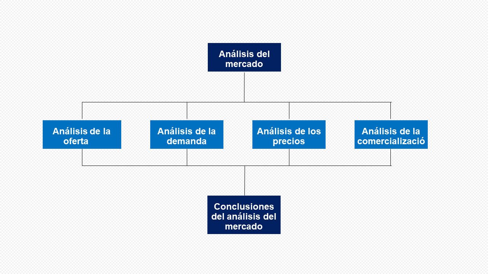
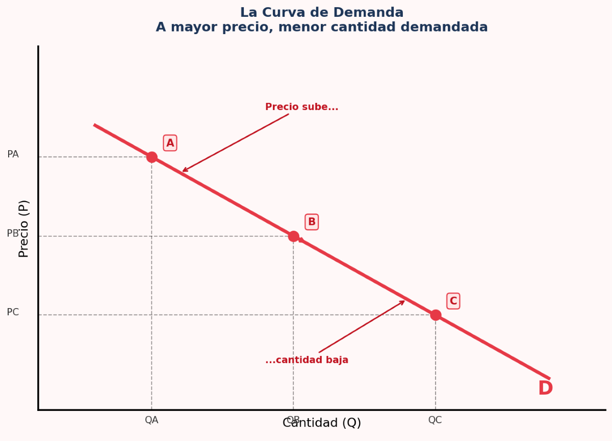
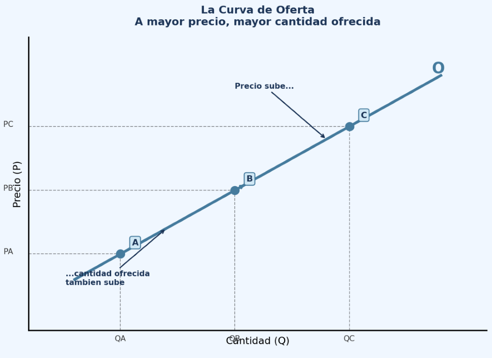
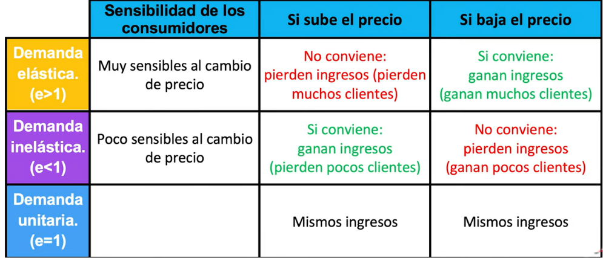

```{r}
#| label: setup
#| include: false

knitr::opts_chunk$set(
  fig.width = 6,
  fig.height = 3,
  fig.align = "center",
  cache = TRUE,         # ← add this
  dpi = 150             # default is 300 — halves render time for fig.
)

```


::: {style="text-align: center;"}
<br>
<br>
**Universidad del Sol** 

<br>
<br>

7to. Semestre – Administración de Empresas / Ing. Comercial


:::
------------------------------------------------------------------------

### Objectivo general {.unnumbered}

Al concluir el estudio de este capítulo el alumno conocerá, comprenderá
y aplicara una metodología para realizar un estudio de mercado enfocado
a la evaluación de proyectos.

---

### Objetivos especificos {.unnumbered .smaller}

- *Definir*    que es demanda y oferta.
- *Explicar*   cuales son los componente y etapas de la investigación de mercado.
- *Explicar*   métodos de investigación y técnicas de pronósticos de mercado.


# Introduccion

Para entender la viabilidad de un proyecto de inversión, no basta con
tener una buena idea; es imperativo comprender las fuerzas invisibles
que determinarán si esa idea se transformará en ingresos reales. En el
marco de un estudio de factibilidad, la Demanda y la Oferta no son solo
curvas en un gráfico, sino la representación del comportamiento humano y
empresarial bajo condiciones de escasez.
A continuación, se detalla la conceptualización técnica de ambos pilares:

---

## Estructura de analisis



## El mercado

-	Escasez y Asignación: La economía busca asignar recursos limitados
(capital, trabajo, insumos) para satisfacer necesidades humanas ilimitadas.

-	Definición de Mercado: Es el lugar donde se realizan transacciones de
bienes y servicios por dinero. En un mercado competitivo, hay tantos compradores y vendedores que ninguno puede influir por sí solo en el precio.

-	Equilibrio de Mercado: Se alcanza cuando el precio y la cantidad
motivan tanto a productores a fabricar como a consumidores a adquirir el bien.


## La Demanda: La Perspectiva del Mercado Meta

- En un estudio de factibilidad, la demanda es la cuantificación de la
necesidad o el deseo de un bien o servicio, [respaldado por el poder
adquisitivo.]{.underline} Para un administrador, no solo importa cuánta gente "quiere"
el producto, sino **cuántos están dispuestos y pueden pagarlo a distintos
niveles de precio.**

---

La demanda es la búsqueda de satisfactores para una necesidad. Es vital
entender qué la mueve:

-	Ley de la Demanda: Generalmente, si el precio sube, la cantidad demandada baja (y viceversa), lo que se gráfica como un movimiento sobre la misma curva.

-	Factores que desplazan la curva: Variables ajenas al precio que hacen que la demanda total cambie:

-	Ingresos: Si el ingreso sube, aumenta la demanda de "bienes normales", pero puede bajar la de "bienes inferiores".

---

-	Bienes Relacionados: Los complementarios (si sube el precio de uno, baja la demanda del otro, como cine y palomitas) y los sustitutos (si baja el precio del sustituto, cae la demanda de nuestro producto).

-	Gustos y Expectativas: Las preferencias personales y lo que el cliente espera del futuro afectan el consumo actual.

---

### La curva de la demanda {.smaller}

- La curva de demanda representa el comportamiento de los [**compradores.**]{.underline}
Tiene pendiente negativa (va hacia abajo) porque existe una relación
inversa entre el precio y la cantidad: cuanto más caro es un bien, menos
unidades la gente quiere comprar.

- En el siguiente gráfico vemos tres puntos:    
•	Punto A: El precio es alto → los compradores piden poca cantidad.   
•	Punto B: Precio intermedio → cantidad intermedia.   
•	Punto C: El precio es bajo → los compradores demandan mucha más cantidad.

---

## {.unnumbered .bigger}

[**Ley de la Demanda:**]{.underline}

Cuando el precio sube, la cantidad demandada baja.    
Cuando el precio baja, la cantidad demandada sube.

---



## La curva de la oferta

- La curva de oferta representa el comportamiento de los [**vendedores.**]{.underline}
Tiene pendiente positiva (va hacia arriba) porque existe una relación directa
entre el precio y la cantidad ofrecida: cuanto más alto es el precio,
más les conviene producir y vender.

- En el gráfico vemos tres puntos:    
•	Punto A: El precio es bajo → los vendedores ofrecen poca cantidad (no es rentable).   
•	Punto B: Precio intermedio → cantidad intermedia.   
•	Punto C: El precio es alto → los vendedores ofrecen mucha más cantidad.

---

## {.unnumbered .bigger}

[**Ley de la Oferta:**]{.underlinde} 

Cuando el precio sube, la cantidad ofrecida también sube.   
Cuando el precio baja, la cantidad ofrecida también baja.

---



---


## La oferta y demanda - un ejemplo {.smaller}

- Imagina que estás en un mercado de frutas. Hay dos grupos de personas:    
los compradores (que quieren fruta) y los vendedores (que tienen fruta para vender).
La oferta y la demanda es simplemente la historia de cómo estos dos grupos
interactúan para ponerse de acuerdo en un precio.

- La Curva de Demanda — El lado de los Compradores    
Cuanto más barato es algo, más gente lo quiere.
Si las manzanas cuestan $10 cada una, probablemente comprarías solo una,
o ninguna. Pero si cuestan $0,50, llenarías tu canasta. Esta es la Ley de
la Demanda: cuando el precio sube, la cantidad demandada baja. Por eso la
curva de demanda tiene pendiente negativa
(va hacia abajo de izquierda a derecha) — es simplemente la naturaleza humana.


---

La Curva de Oferta — El lado de los Vendedores

Cuanto más alto es el precio, más quieren producir los vendedores.
Si las manzanas se venden a $0,50, los agricultores apenas se molestan — no vale la pena su esfuerzo. ¿Pero a $10 cada una? ¡Plantarían todos los campos que tuvieran!

Esta es la Ley de la Oferta: cuando el precio sube, la cantidad ofrecida
también sube. Por eso la curva de oferta tiene pendiente positiva.


## Ejercicios practicos

[Eventos reales que influyen en la oferta y demanda](https://econarena.com/games/supply-demand)


## El Comportamiento del Consumidor

•	Utilidad Marginal Decreciente: La satisfacción que da cada unidad adicional de un bien tiende a disminuir. El punto de saciedad ocurre cuando la satisfacción adicional es cero; consumir más allá produce insatisfacción.
•	Restricción Presupuestaria: Los consumidores tienen ingresos limitados y deben elegir la combinación de bienes que maximice su utilidad dentro de ese presupuesto.
•	Indiferencia: Existen "curvas de indiferencia" que muestran combinaciones de productos que dan la misma satisfacción al cliente (ej. producto substituto perfecto:
libro impreso - libro electrónico, producto complementario: tablet - funda tablet)

## Estructuras y Fallas de Mercado
No todos los mercados son perfectos. Existen imperfecciones que debemos identificar:
•	Monopolio/Monopsonio: Un solo vendedor o un solo comprador controla el precio.
•	Oligopolio/Oligopsonio: Un grupo pequeño de empresas o compradores domina el mercado.

## Elasticidades


